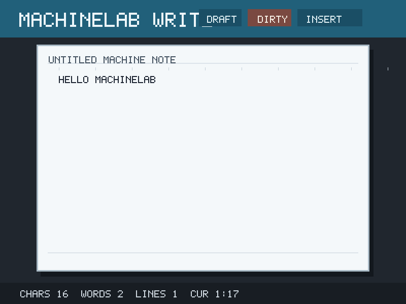
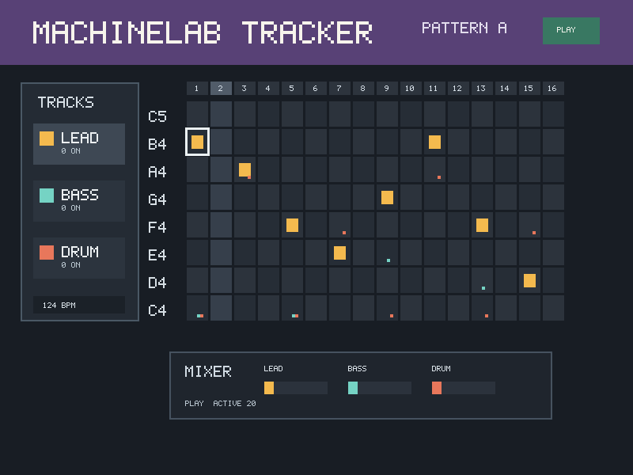
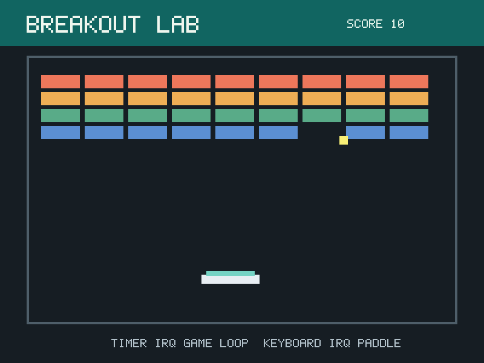

# Machine Lab

Machine Lab is a portable C course kit for teaching how programs talk to
machine-like devices: ports, IRQs, framebuffers, audio buffers, serial links,
and event loops. It keeps the useful ideas from older PC/Minix lab work, then
removes the VM and service-management ceremony so students can focus on the
machine model and the program they are building.

The historical LCOM material is treated as source material, not as the public
identity. The CLI is `machinelab`; `lcom` and `lowlab` stay as compatibility
aliases, and the C API still uses `lcom_*` names so older examples and lab code
remain easy to port.

<p>
  
  
</p>
<p>
  
  
</p>

[Watch the 90-second demo](docs/assets/demo/machine-lab-90s.mp4): setup, a
failing lab test, the word processor, the music maker, and a captured project
artifact.

The public docs site is live at <https://machine-lab-docs.pages.dev/>. Its
source lives in [docs-site](docs-site) and is built with VitePress for
Cloudflare Pages. It is the canonical public surface for lab guides, adoption,
developer docs, examples, and launch posts.

## Choose Your Lane

| Audience | Start here | Work area |
| --- | --- | --- |
| Students | [Student guide](docs/student-guide.md) | generated workspace from `machinelab setup` |
| Instructors | [Adoption guide](docs/adoption.md), [Instructor guide](docs/instructor-guide.md) | lab sequence, handouts, rubrics, examples |
| Machine Lab developers | [Developer guide](docs/developer-guide.md) | this repository's runtime, docs, tests, releases |
| Curious users | [Examples](examples/README.md) | runnable demos and project seeds |

Students should not need to understand this repository's CMake, runtime
internals, release workflow, or reference solutions. Developers should keep
that boundary intact.

## Developer Quick Start

```sh
devenv shell
machinelab-test
machinelab run build/examples/flappy_bird
```

Inside the dev shell:

- `machinelab` runs `./build/machinelab`, building it first if needed.
- `machinelab-build` configures and builds with SDL enabled.
- `machinelab-test` builds everything and runs unit, lab, and integration tests.
- `lcom`, `lowlab`, and `mlab` are compatibility aliases for `machinelab`.

Without `devenv`, install CMake 3.20+, Ninja, a C/C++ toolchain, and optionally
SDL3 plus SDL3_ttf. This path is for building Machine Lab itself:

```sh
cmake -S . -B build -G Ninja -DMACHINE_LAB_WITH_SDL=OFF
cmake --build build
ctest --test-dir build --output-on-failure
```

## Student-Facing Course Surface

- focused lab functions for bits, RTC, timers, keyboard, mouse, graphics,
  audio, and UART;
- reusable C helper libraries that the final project can link against;
- deterministic replay scripts for input-heavy programs;
- visible artifacts: traces, screenshots, WAVs, videos, and app bundles;
- final projects such as games, editors, trackers, protocol demos, or visual
  tools.

Fresh lab stubs compile and intentionally fail predefined checks until students
fill the guided gaps.

Students normally see:

- `machinelab setup <workspace>`
- `machinelab test <lab> --project <workspace>`
- the generated `README.md`, `Makefile`, `include/lcom/`, `labs/`, `lib/`, and
  `proj/` folders;
- lab handouts in [course/labs/docs](course/labs/docs).

Students normally do not see:

- `runtime/`, `common/`, `.github/`, release packaging, CMake internals;
- reference solutions, except when an instructor intentionally publishes them;
- `tests/integration.sh` and host-runtime regression tests.

## Instructor Course Map

| Lab | Device idea | Typical check |
| --- | --- | --- |
| 1 | bit masks, CMOS/RTC reads, BCD conversion | `machinelab test rtc` |
| 2 | i8254 PIT divisors and IRQ0 event loops | `machinelab test timer` |
| 3 | i8042 keyboard status and scancodes | `machinelab test kbd` |
| 4 | PS/2 mouse commands and packet parsing | `machinelab test mouse` |
| 5 | VBE modes, mapped framebuffers, sprites | `machinelab test graphics` |
| 6 | AC97-style PCM buffers and playback | `machinelab test audio` |
| 7 | 16550 UART setup, FIFOs, loopback, protocols | `machinelab test uart` |

The first half works like a lab track. The second half is a project studio:
students combine several device areas into one reactive C application.

## Runtime Features For Courses

- virtual i8254 PIT, i8042 keyboard/mouse, RTC/CMOS, VBE framebuffer,
  AC97-lite audio, and 16550 UART devices;
- interactive SDL display, keyboard, mouse, text overlay, and audio;
- deterministic headless execution for tests and CI;
- authored replay scripts, live recording, captions, frame dumps, WAV capture,
  MP4 rendering, and JSONL traces;
- paired runtimes with bridged serial ports for two-player or protocol work;
- generated student workspaces with Makefiles, lab stubs, test contracts, and
  reference-solution-backed checks;
- single-file or directory app bundles for finished projects.

## Example Projects

```sh
machinelab run --headless --script scripts/write_note.mlabscript \
  --dump-frame build/write.ppm -- build/examples/word_processor

machinelab run --headless --script scripts/music_maker_demo.mlabscript \
  --audio-wav build/music.wav --dump-frame build/music.ppm -- build/examples/music_maker

machinelab run --headless --script scripts/breakout_demo.mlabscript \
  --dump-frame build/breakout.ppm -- build/examples/breakout_demo
```

The examples are deliberately more than toy snippets:

- `word_processor`: cursor movement, insertion/deletion, wrapping, scrolling,
  status bars, and document stats.
- `music_maker`: tracker grid, tempo, playhead, per-track instruments, mixer
  meters, and generated PCM output.
- `breakout_demo`: timer-driven physics, keyboard state, collision, score,
  lives, and a game HUD.
- `flappy_bird`, `ninjix`, and `pvz`: larger ports that exercise game loops,
  rendering, input, audio, and project structure.

## Student Workspace

```sh
machinelab setup student
make -C student
machinelab test rtc --project student
```

Generated workspaces contain:

| Path | Purpose |
| --- | --- |
| `include/lcom/` | public runtime/device headers |
| `labs/<device>/` | guided starter implementations |
| `lib/<device>/` | optional reusable helpers |
| `proj/` | tiny app linked with lab objects |
| `.mlab/` | copied tests and generated build artifacts |

## Docs

- [Public docs site source](docs-site): canonical VitePress site for students, instructors, and maintainers.
- [Docs index](docs/index.md): student-facing, teacher-facing, and developer-facing map.
- [Student guide](docs/student-guide.md): generated workspace workflow.
- [Adoption guide](docs/adoption.md): how to use Machine Lab in a class in one week.
- [Instructor guide](docs/instructor-guide.md): adoption and course operation.
- [Developer guide](docs/developer-guide.md): maintaining Machine Lab itself.
- [Getting started](docs/getting-started.md): local repo prerequisites and daily commands.
- [Course labs](course/README.md): lab flow, handouts, and project studio.
- [Examples](examples/README.md): focused demos and complete project seeds.
- [Runtime and CLI](docs/runtime-and-cli.md): execution, capture, replay, bundles.
- [Architecture](docs/architecture.md): process boundary and virtual devices.
- [From Minix to Machine Lab](docs/from-minix.md): what stayed and what changed.
- [Video demo](docs/video-demo.md): short teacher-demo script.
- [Roadmap](docs/roadmap.md): implemented scope and future work.
- [Contributing](CONTRIBUTING.md): contribution rules and review checklist.

Run the generated CLI reference at any time:

```sh
machinelab docs cli
```

## Repository Map For Developers

| Path | Audience | Purpose |
| --- | --- | --- |
| `sdk/include/lcom/` | students | public C headers copied into workspaces |
| `course/labs/docs/` | students/instructors | lab handouts |
| `course/labs/templates/` | students | starter API contracts copied by `machinelab setup` |
| `examples/` | instructors/developers | demos and final-project seeds |
| `scripts/` | instructors/developers | deterministic input/replay timelines |
| `docs-site/` | public | VitePress website deployed to Cloudflare Pages |
| `runtime/`, `common/`, `sdk/client/` | developers | runtime server, protocol, and C client |
| `dev/lab-solutions/`, `dev/lab-tests/`, `tests/` | developers/instructors | reference checks and regression tests |
| `.github/workflows/release.yml` | developers | Linux, macOS, and Windows release builds |

The runtime is an educational device model, not a replacement for an operating
systems internals course. It is meant to make device-shaped C programming
observable, testable, and portable enough for a public course.

## License

- Code: [MIT License](LICENSE).
- Course material, docs, screenshots, and demo media: [CC BY 4.0](course/LICENSE.md).
